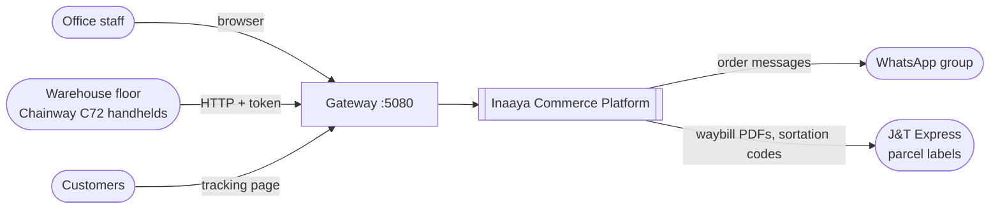
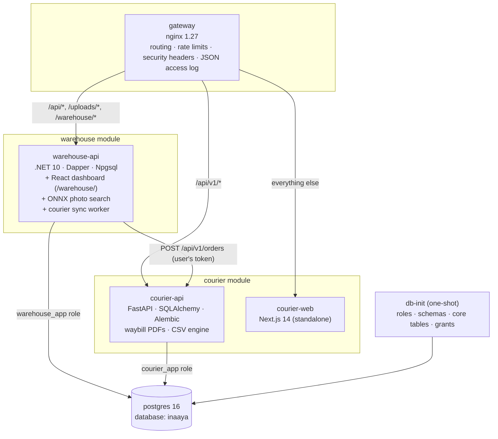
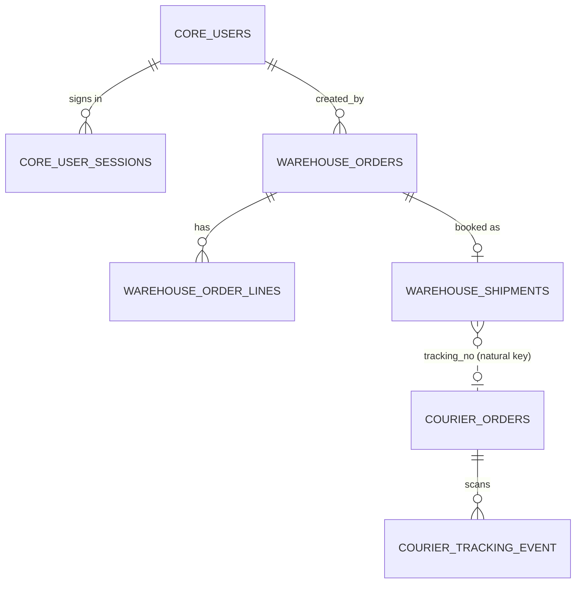
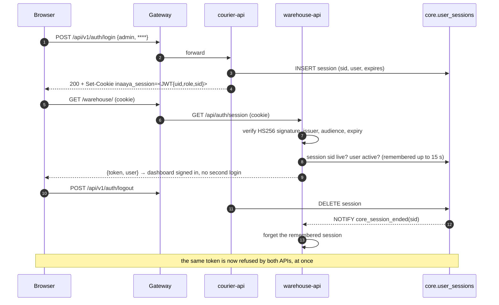
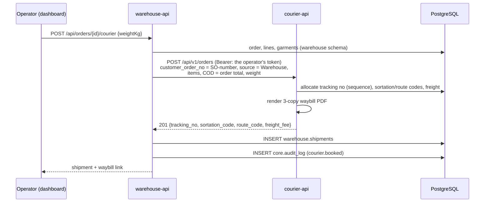

# Architecture

The Inaaya Commerce Platform is a **modular monolith on a shared database**:
two independently built modules — the clothing warehouse (.NET) and the J&T
courier portal (Python) — deployed together, integrated through one PostgreSQL
database, one identity and one gateway, while each module keeps ownership of
its own data and code.

## 1. Context



## 2. Containers



| Service | Image | Port (internal) | State |
|---|---|---|---|
| gateway | nginx:1.27-alpine | 80 → host 5080 | stateless |
| warehouse-api | `apps/warehouse/Dockerfile` | 8080 | photos: bind mount; model: read-only mount |
| courier-api | `apps/courier/backend/Dockerfile` | 8000 | waybills + WhatsApp outbox: volumes |
| courier-web | `apps/courier/frontend/Dockerfile` | 3000 | stateless |
| postgres | postgres:16-alpine | 5432 → 127.0.0.1:5433 | `inaaya_pgdata` volume |
| db-init | postgres:16-alpine | — | runs `database/init/*.sql`, exits |

Start order is enforced with health checks: postgres healthy → db-init
completed → APIs healthy (database reachable, schema migrated) → portal → gateway.

## 3. Data

### One database, one schema per bounded context

| Schema | Owner role | Contents | Migrated by |
|---|---|---|---|
| `core` | platform (superuser) | `users`, `user_sessions`, `audit_log` | `database/init/10-core.sql` |
| `warehouse` | `warehouse_app` | rooms, catalogue, variants, batches, items, orders, order lines/items, returns, movements, find requests, **shipments** | `Data/schema.sql`, applied idempotently at API start under an advisory lock |
| `courier` | `courier_app` | sender profile, postcode zones (79k), import batches/rows, orders (parcels), tracking events, `tracking_seq` | Alembic (`alembic upgrade head` at container start) |

### Least privilege

```
                 core              warehouse           courier
warehouse_app    read/write        OWNER               read only
courier_app      read/write        read only           OWNER
```

A module can **read** the other's tables (for display and for the status sync)
but can only **change** them through that module's API. PostgreSQL enforces
this: `UPDATE warehouse.orders` as `courier_app` fails with *permission denied*.

### Where the modules meet



`warehouse.shipments.tracking_no` ↔ `courier.orders.tracking_no` is a
**natural-key link, deliberately not a foreign key**: the courier schema is
migrated by a different service on its own schedule, and a cross-schema FK would
make one module's migrations depend on the other's. Uniqueness is enforced on
both sides.

### Types and conventions

* All timestamps are `timestamptz` (UTC). Business dates (order numbers, daily
  reports, the courier calendar) use the shop's zone, `APP_TIMEZONE`
  (Asia/Kuala_Lumpur), and both user interfaces show every time in it — the
  warehouse API names the zone at sign-in — so a time reads the same on every
  screen whatever the viewing computer's own clock says.
* Enumerations are `varchar` + `CHECK`, not PostgreSQL enums, so adding a value
  is one line and needs no type migration.
* Case-insensitive identity: `core.users.username`/`email` are `citext`.
  Catalogue names are compared with `lower()` where the MySQL collation used
  to ignore case.
* Numeric flags the handhelds read (`active`, `returned_here`) stay numbers.

## 4. Identity and sessions



* **One token format** shared by both services: HS256 JWT, issuer and audience
  `inaaya-platform`, claims `uid`, `username`, `name`, `role`, `sid`. Secret:
  `AUTH_JWT_SECRET`. Contract in `Warehouse.Api/Auth.cs` and
  `courier/backend/app/core/auth.py`.
* **Revocable**: a token is only valid while its `core.user_sessions` row
  exists. Logout deletes one row; blocking an account or resetting a password
  deletes all of them — on every module and handheld at once. The warehouse
  remembers a live session for a few seconds (a handheld scans many tags a
  minute); a trigger announces every ended session on the channel
  `core_session_ended` and the warehouse, listening, forgets it immediately.
  If that connection drops, the 15-second memory is the upper bound.
* **Transport**: browsers use the `inaaya_session` cookie (HttpOnly,
  SameSite=Lax, Secure in production). Handhelds and the dashboard use
  `Authorization: Bearer`. The warehouse forwards the user's own token when it
  calls the courier API, so permissions and audit identity carry across.
* **Passwords**: PBKDF2-SHA256 (390,000 iterations) written by both modules;
  bcrypt hashes carried over from the MySQL warehouse still verify and are
  rehashed at the next login.
* **Roles**

| Role | Warehouse API | Courier merchant portal | Courier admin portal |
|---|---|---|---|
| `admin` | everything | yes | yes |
| `operator` | intake, picking, returns, finding, booking parcels | yes | — |
| `merchant` | refused (403) | yes | — |

## 5. Integration flows

### Book a J&T parcel from a warehouse order



Idempotent: a second booking of the same order is refused (409, naming the
parcel), and the courier refuses a duplicate `customer_order_no`.

### Tracking status back into the warehouse

`CourierSyncService` (every `COURIER_SYNC_SECONDS`, advisory-locked so one
replica runs it):

1. copies `courier.orders.tracking_status` into `warehouse.shipments.status`
   where it changed;
2. **DELIVERED** → the warehouse order becomes `delivered`, stamped with the
   courier's scan time;
3. **RETURNED** → a return is opened (`requested`) so the returns desk expects
   the parcel; garments are still verified tag by tag at the counter.

Every step is idempotent and re-evaluated each pass, so an order still being
picked when its parcel was delivered catches up as soon as it ships.

## 6. One interface, two applications

The two modules are written in different frameworks - a React dashboard built by
Vite, a Next.js portal - and are deliberately not merged into one bundle: each
module keeps its own release, its own tests and its own runtime. What they share
is what a person sees:

| | Where it is set |
|---|---|
| Wordmark ("Inaaya" over spaced capitals) | `courier/frontend/components/brand/Logo.tsx`, `warehouse/dashboard/src/components.jsx` |
| Colours: ink `#030302`, tint `#f4f2ee`, lines `#dcdfe6`, status colours | `courier/frontend/tailwind.config.ts`, the `:root` block of `warehouse/dashboard/src/styles.css` |
| Typeface: Plus Jakarta Sans, Cormorant Garamond for the wordmark | the `<head>` of both applications, with a system fallback for a handheld with no internet |
| Chrome: white side menu with the wordmark, top bar with the page and the account | `courier/frontend/components/layout/*`, `warehouse/dashboard/src/App.jsx` |
| Square corners (2px), 40px controls, icon set | the two stylesheets and `warehouse/dashboard/src/icons.jsx` |
| The clock | `APP_TIMEZONE`; the warehouse API names it at sign-in, the portal has it in `lib/myt.ts` |

Both fold the menu into a drawer below a laptop width, so a phone or a packing
bench tablet gets the same screens rather than a desktop page squeezed sideways.
A status is the same colour in both modules: a parcel *in transit* is amber
wherever it is read.

## 7. Security controls

| Area | Control |
|---|---|
| Transport | one origin behind the gateway; HTTPS terminated in front (see DEPLOYMENT.md); `COOKIE_SECURE=true` |
| Authentication | signed, expiring, server-revocable sessions; constant-time password checks; identical message for unknown user and wrong password |
| Brute force | per-client login rate limit at the gateway and in each API |
| CSRF | cookie-authenticated writes must come from the same site (`Sec-Fetch-Site`, or `Origin` compared with the host the gateway forwards, port included), in both APIs; SameSite=Lax cookie |
| Authorisation | role checks next to every write; merchants cannot reach the warehouse API |
| Database | per-module roles; cross-module writes impossible; DB port bound to 127.0.0.1 |
| Secrets | `.env` only (git-ignored); production refuses to start with a missing or placeholder signing secret |
| Containers | non-root users, no SDKs in runtime images, health checks, restart policies |
| Headers | `X-Content-Type-Options`, `X-Frame-Options`, `Referrer-Policy`, `Permissions-Policy`; internal docs and health endpoints not exposed |
| Audit | `core.audit_log`: logins (success and failure), account changes, courier bookings, status syncs |
| Errors | no stack traces or SQL to clients; details go to the logs with the request id |

## 8. Observability

* **Request id**: the gateway assigns `X-Request-ID` (or keeps the caller's),
  both APIs log it and return it, so one id follows a request through
  gateway → warehouse → courier.
* **Logs**: JSON lines from all three tiers (`docker compose logs`), rotated
  (10 MB × 5 per container).
* **Health**: `/health/live` and `/health/ready` on both APIs (the latter checks
  the database and migrations); `/api/health` for the handhelds;
  `/gateway/health`. Docker restarts unhealthy containers.

## 9. Decisions

| # | Decision | Why | Alternatives considered |
|---|---|---|---|
| 1 | **PostgreSQL** as the single database | J&T depends on PostgreSQL-only features (sequences allocated in one round trip, partial unique indexes, `ON CONFLICT`, JSONB, `COPY` for 79k postcodes); the warehouse used ~55 MySQL-specific constructs that port cleanly. PostgreSQL also gives schemas, row-level grants and transactional DDL. | MySQL: would have meant re-implementing sequences, `RETURNING` and partial indexes for J&T and losing its measured bulk-import performance. |
| 2 | **Schema per module**, not merged tables | Each module keeps ownership and its own migration tool; both had a table called `orders` with different meanings. | One flat schema (name clashes, no ownership); separate databases (not "one database", no cross-module reads). |
| 3 | **Shared JWT + session table** for identity | Stateless verification on the hot path (handheld scans) with immediate revocation via the session row (cached briefly). | A separate identity service (one more thing to run tomorrow); keeping two logins. |
| 4 | **API call with token relay** for booking | Business rules for creating a parcel stay in the courier module; the user's permissions apply. | Writing into `courier.orders` from .NET (duplicates J&T logic, bypasses validation). |
| 5 | **Polling sync** for tracking status | Simple, idempotent, survives restarts; a few seconds' delay is irrelevant for parcel status. | `LISTEN/NOTIFY` or a message broker — sensible later, more moving parts now. |
| 6 | **Gateway on :5080** | Handhelds in the field already search the LAN for :5080 — no APK rebuild, no reconfiguration. | :80/:443 directly (put TLS in front instead). |
| 7 | **Keep both frontends**, linked | Each is complete and tested; unifying UI frameworks is a rewrite with no user-visible benefit. They share login, navigation links and data. | Rewriting the dashboard in Next.js. |
